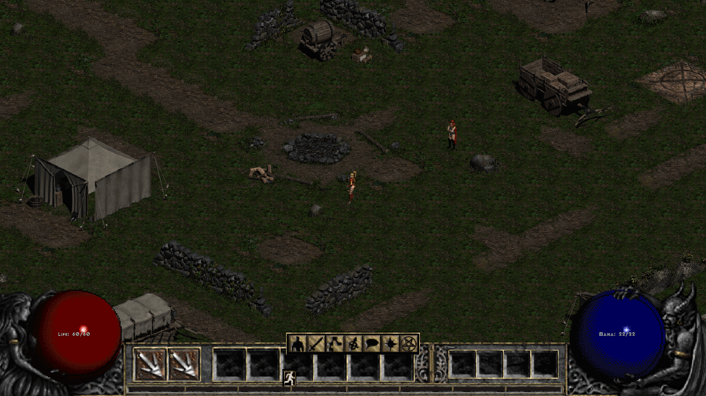
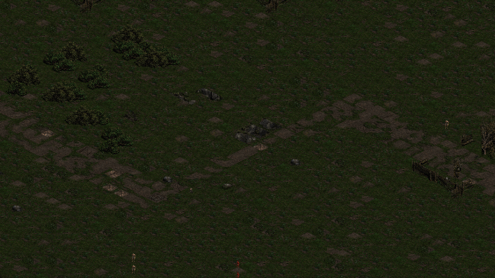
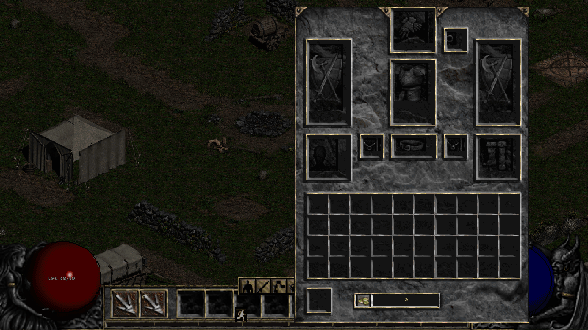
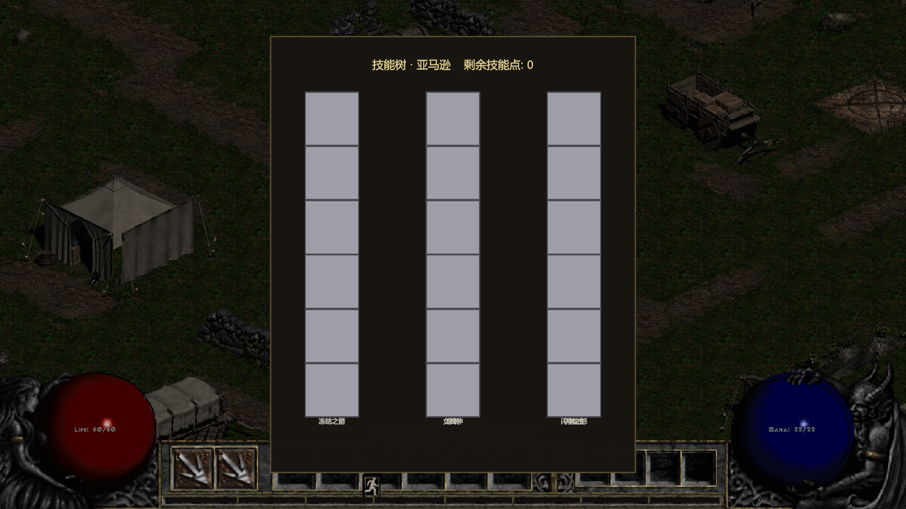

# clover-project-diablo2

用 [Clover 客户端引擎](https://github.com/qw576483/clover-client-unity-engine) **1:1 复刻《暗黑破坏神 II》**的项目工程。

**复刻范围**：Act I —— **罗格营地 / 血腥荒野 / 邪恶洞穴** + 主线任务 1。

| 罗格营地 | 血腥荒野 |
|---|---|
|  |  |

| 背包 | 技能树 |
|---|---|
|  |  |

> 截图来自本工程的实机取证（复刻版真实运行画面，非原版素材）。

## 目录结构

| 路径 | 内容 |
|---|---|
| `client/` | Unity 工程（复刻本体；`Library/` `Temp/` `Logs/` 等生成物不入库） |
| `策划/` | `策划案/暗黑破坏神2参考规格.md`（复刻规格）、`验收表.md`（交付闸门）、`对照表`、`核验报告.md`、`素材调研.md`、`数值文档/`（10 类原版数值：item / monster / skill / class / level / experience / missile / affix / monumod / treasureclass，各含 `xlsx` + `txt`）、`自审对比/`（UI / 场景 / 数值 / 启动链路逐项对照 + bug 清单） |
| `tools/` | 判据与工具：`probes/`（`hosts/` 为 dotnet 探针宿主：playercheck / savecheck / uicheck；`measure/` 为面板扫描与切图脚本；`refs/` 为参考 HUD 切图；`ledger/` 为 dispatch / play 日志）、`table/`（打表配置）、`table-convert/`（中文名与数值转换脚本）、`_maps/`（Town / BloodMoor / DenOfEvil 地图数据） |
| `docs/` | `接线报告.md`、`配表说明.md`、`步骤文档.md` + `agents/`（并行任务书） |

## 怎么跑

1. Unity **6000.x** 打开 `client/`；
2. `cd` 进 `client/` 后按 `策划/验收表.md`「驱动环境」一节执行 Unity CLI。注意该工程的固定顺序：
   `editor_stop` → `clear_console` → `editor_play` → `eval_file --file _dev/p_runbg.cs`（打开后台运行+解除帧率限制，**不先跑这条，编辑器一失焦游戏循环就停**）；
3. 改代码后用 `unity command recompile` + 轮询 `recompile_status`（**本工程 Pipeline 没有 `refresh` 命令**）。

## 验收口径

`策划/验收表.md` 是**交付闸门**：行 = 参考游戏的系统清单，结论列不许为空/不许写「待验」。

工程内还有两条本项目专属的硬规则：

- **链式流程必须从真实现场触发一次**，不许读代码推断"下一环会自己走"；
- **"定义了但没人用"是本项目最高频缺陷** —— 看到从没被读/被调的常量、枚举、资源名，99% 是漏接线。

## 相关仓库

| 仓库 | 说明 |
|---|---|
| [clover-client-unity-engine](https://github.com/qw576483/clover-client-unity-engine) | 客户端引擎（本工程的运行底座） |
| [clover-tools](https://github.com/qw576483/clover-tools) | 打表工具（`tools/table` 与本仓库 `tools/table` 配合使用）、AI 交付 skill |
| [clover-doc](https://github.com/qw576483/clover-doc) | 框架文档 |
