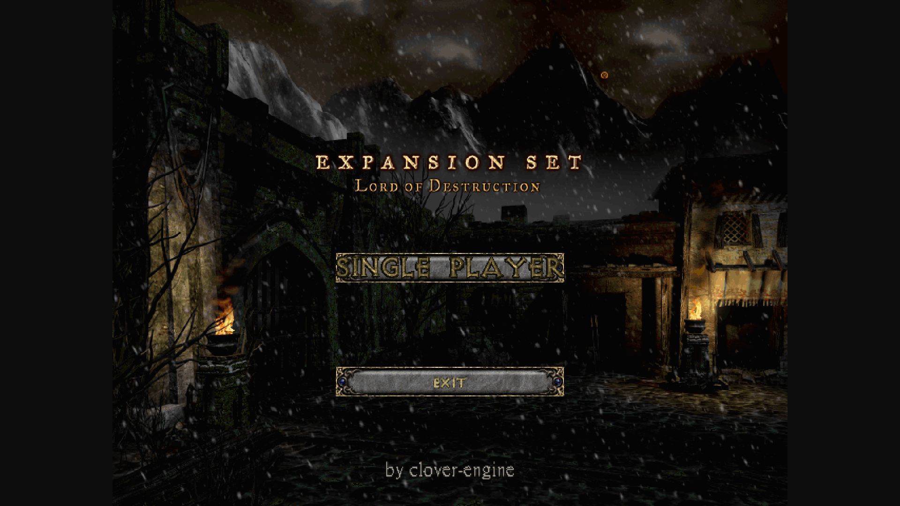
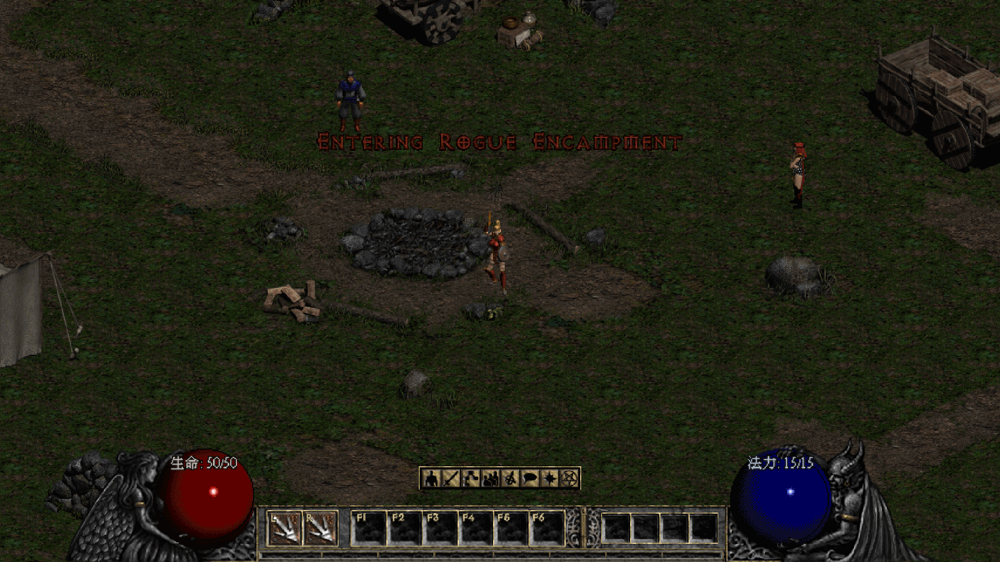
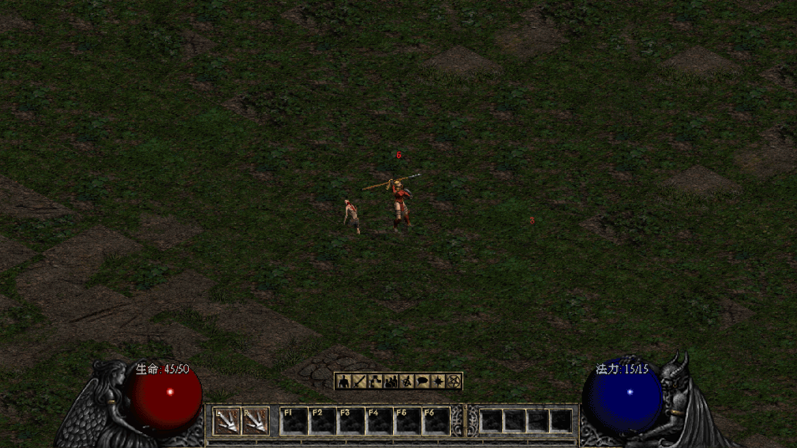
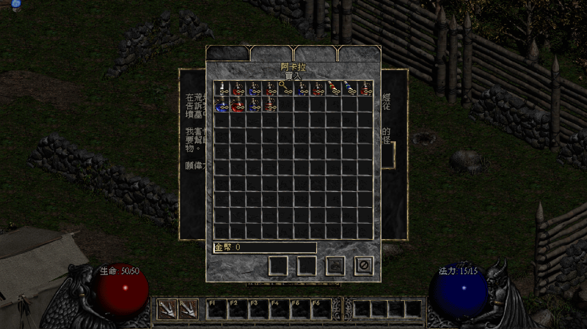
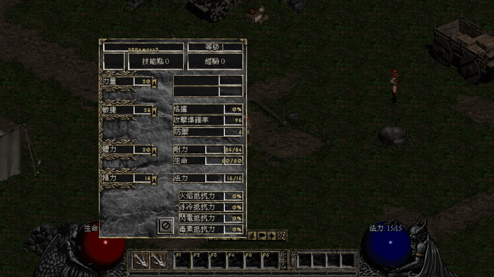
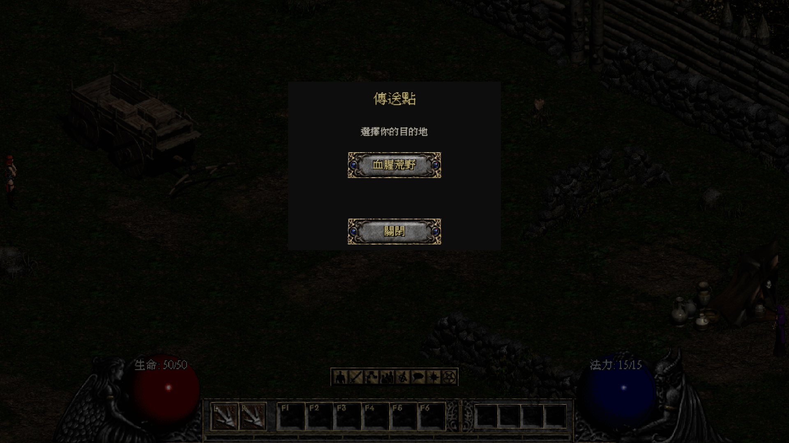
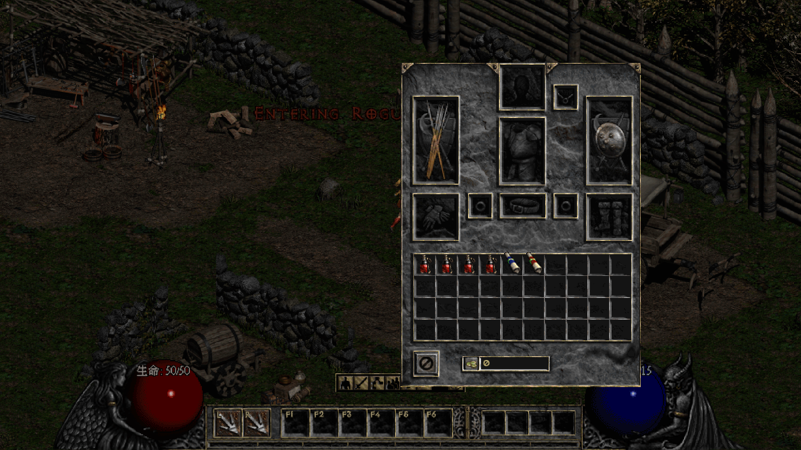
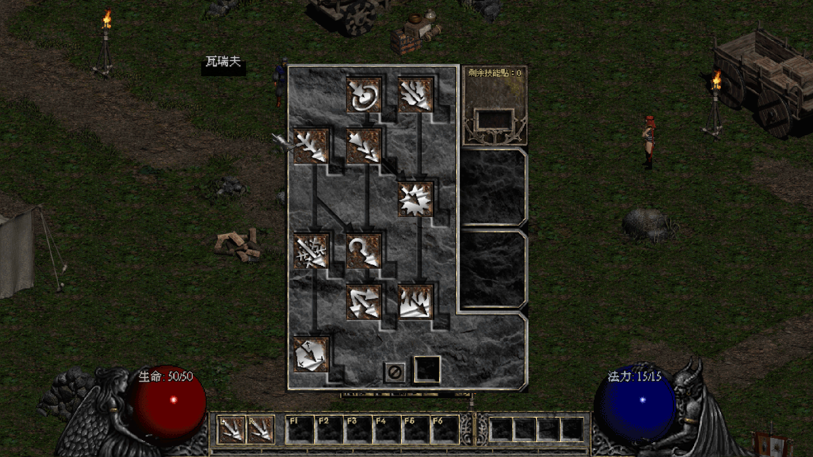

# Clover × Diablo II

用 [Clover 客户端引擎](https://github.com/qw576483/clover-client-unity-engine) **1:1 复刻《暗黑破坏神 II》**的工程。
**单机版**（不接服务端、不联网）。复刻范围 = Act I：**罗格营地 / 血腥荒野 / 邪恶洞穴** + 主线任务 1（Den of Evil）。

游戏内容：等距视角点击移动与战斗、怪物 AI 与精英词缀、NPC 对话 / 商店 / 修理、传送点跨区域、
装备 / 背包 / 腰带、技能树、人物属性、任务日志、自动地图（automap）、音效与 BGM、
一角色一文件的本地存档。可选职业：亚马逊 / 野蛮人。

## 实机画面

| 主菜单 | 罗格营地 |
|---|---|
|  |  |

| 血腥荒野战斗 | 商店 |
|---|---|
|  |  |

| 人物面板 | 传送点 |
|---|---|
|  |  |

| 背包 | 技能树 |
|---|---|
|  |  |

> 以上均为本工程复刻版的**实机运行画面**（非原版游戏截图）。

## 怎么玩

1. Unity **6000.6.0f1** 打开 `client/`（首次导入素材较慢，属正常）；
2. 打开 `Assets/Scenes/Boot.unity` 进 Play：启动画面按任意键 → 主菜单「SINGLE PLAYER」→ 选已有角色或「NEW HERO」建角 → 读条进罗格营地；
3. 引擎包 `com.clover.unity-engine` 由 UPM 自动从 [clover-client-unity-engine](https://github.com/qw576483/clover-client-unity-engine) 拉取（首次打开联网克隆，之后走本地缓存）—— **需本机已装 Git 且在 `PATH` 里**。

操作（沿用原版键位）：

| 键 | 作用 |
|---|---|
| 鼠标左键 | 移动 / 攻击 / 拾取 / 与 NPC、传送点交互 |
| `I` / `C` / `T` / `Q` | 背包 / 人物属性 / 技能树 / 任务日志 |
| `Tab` | 自动地图（automap） |
| `Esc` | 暂停菜单 / 关闭当前面板 |
| `Shift` | 站立不动攻击 |
| `Alt` | 显示地面物品名 |
| `R` | 走 / 跑切换 |
| `1`~`4` | 腰带药水 |
| `F1`~`F8` | 技能槽（F1~F4 左键、F5~F8 右键） |

## 工程结构

| 路径 | 内容 |
|---|---|
| `client/` | Unity 工程（复刻本体；`Library/` `Temp/` `Logs/` 等生成物不入库） |
| `策划/` | 复刻规格（`策划案/暗黑破坏神2参考规格.md`）、验收表、原版数值文档（item / monster / skill / class / level 等 11 类，含 `xlsx` + `txt`）、自审对比 |
| `tools/` | 判据与工具：探针宿主（`probes/hosts/`）、面板测量与切图脚本（`probes/measure/`）、打表配置、地图数据、项目级 skill（`ai-skill/`） |
| `docs/` | 接线报告、配表说明、步骤文档与并行任务书（`agents/`）、实机图（`images/`） |
| `引擎问题.md` | 引擎缺口 / 引擎 bug / skill 问题登记 |

## 声明

本项目**仅供技术交流与学习**，禁止用于任何商业用途（详见 [`LICENSE`](LICENSE)）。
《Diablo II》的名称、角色形象、图像、音效、数值及其他内容，其著作权与商标权均归 **Blizzard Entertainment** 所有；
原版游戏资源不随本仓库分发。

## 相关仓库

| 仓库 | 说明 |
|---|---|
| [clover-client-unity-engine](https://github.com/qw576483/clover-client-unity-engine) | 客户端引擎（本工程的运行底座） |
| [clover-tools](https://github.com/qw576483/clover-tools) | 打表工具（本工程 `策划/数值文档` 用其生成配置代码） |
| [clover-doc](https://github.com/qw576483/clover-doc) | 框架文档 |
